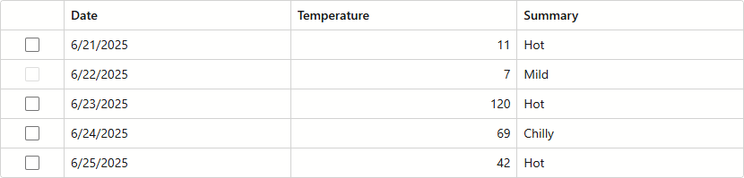

<!-- default badges list -->

<!-- default badges end -->

# Blazor Grid - Disable Selection Checkboxes in Specific Rows

This example prevents users from selecting specific data items in the [DevExpress Blazor Grid](https://docs.devexpress.com/Blazor/403143/grid).

A [selection column](https://docs.devexpress.com/Blazor/DevExpress.Blazor.DxGridSelectionColumn) displays checkboxes that selects/deselects Blazor Grid items. In this example, the Grid component disables selection checkboxes for items whose **Summary** field is set to `Mild`. The **Select All** checkbox also ignores these items.

## Implementation Details

Follow the steps below to enable selection only for items matching your criteria:

1. Use the [DxGridSelectionColumn.CellDisplayTemplate](https://docs.devexpress.com/Blazor/DevExpress.Blazor.DxGridSelectionColumn.CellDisplayTemplate) to replace the built-in checkbox with a custom [DxCheckBox](https://docs.devexpress.com/Blazor/DevExpress.Blazor.DxCheckBox-1) editor.

2. Implement two-way data binding between the [Checked](https://docs.devexpress.com/Blazor/DevExpress.Blazor.DxCheckBox-1.Checked) checkbox property and the template context's [Selected](https://docs.devexpress.com/Blazor/DevExpress.Blazor.GridSelectionColumnCellDisplayTemplateContext.Selected) property.

3. Set the [Enabled](https://docs.devexpress.com/Blazor/DevExpress.Blazor.Base.DxDataEditorBase-2.Enabled) property to `true`/`false`, based on the current item.

4. Place another [DxCheckBox](https://docs.devexpress.com/Blazor/DevExpress.Blazor.DxCheckBox-1) component in the [DxGridSelectionColumn.HeaderTemplate](https://docs.devexpress.com/Blazor/DevExpress.Blazor.DxGridSelectionColumn.HeaderTemplate) to display a custom **Select All** checkbox.

5. Configure this checkbox to [support three states](https://docs.devexpress.com/Blazor/DevExpress.Blazor.DxCheckBox-1#bind-to-custom-data-types) (checked, unchecked, and indeterminate).

6. In the [CheckedChanged](https://docs.devexpress.com/Blazor/DevExpress.Blazor.DxCheckBox-1.CheckedChanged) event, select/deselect all Grid records that match your criteria.

7. Update the **Select All** checkbox state when the Grid raises the [SelectedDataItemsChanged](https://docs.devexpress.com/Blazor/DevExpress.Blazor.DxGrid.SelectedDataItemsChanged) event.

## Files to Review

- [Index.razor](./CS/GridDisabledCheckboxes/Components/Pages/Index.razor)

## Documentation

- [Selection Column](https://docs.devexpress.com/Blazor/DevExpress.Blazor.DxGridSelectionColumn)
- [Cell Display Template](https://docs.devexpress.com/Blazor/DevExpress.Blazor.DxGridSelectionColumn.CellDisplayTemplate)
- [Header Template](https://docs.devexpress.com/Blazor/DevExpress.Blazor.DxGridSelectionColumn.HeaderTemplate)

## More Examples

- [Blazor Grid - How to display detailed information using DxFormLayout](https://github.com/DevExpress-Examples/blazor-DxGrid-Detail-Information-DxFormLayout)
- [Blazor Grid - How to delete selected rows](https://github.com/DevExpress-Examples/blazor-dxgrid-delete-selected-rows)
<!-- feedback -->
## Does This Example Address Your Development Requirements/Objectives?

 

(you will be redirected to DevExpress.com to submit your response)
<!-- feedback end -->
