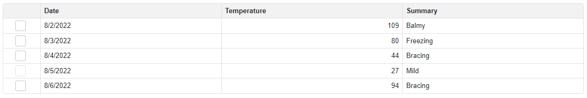

<!-- default badges list -->

<!-- default badges end -->

# Grid for Blazor - Disable Selection Checkboxes in Specific Rows

This example illustrates how to prevent users from selecting specific data items in the [DevExpress Grid for Blazor](https://docs.devexpress.com/Blazor/403143/grid). The Grid component's [selection column](https://docs.devexpress.com/Blazor/DevExpress.Blazor.DxGridSelectionColumn) displays checkboxes that allow users to select and deselect items. In this example, the component disables these checkboxes for items whose `Summary` field is set to `Mild`.

Follow the steps below to allow users to select only the items that match your criteria:

1. Use the [DxGridSelectionColumn](https://docs.devexpress.com/Blazor/DevExpress.Blazor.DxGridSelectionColumn)'s [CellDisplayTemplate](https://docs.devexpress.com/Blazor/DevExpress.Blazor.DxGridSelectionColumn.CellDisplayTemplate) to replace the built-in checkbox with a custom [DxCheckBox](https://docs.devexpress.com/Blazor/DevExpress.Blazor.DxCheckBox-1) editor.

2. Implement two-way data binding between the [Checked](https://docs.devexpress.com/Blazor/DevExpress.Blazor.DxCheckBox-1.Checked) property of the checkbox and the template context's [Selected](https://docs.devexpress.com/Blazor/DevExpress.Blazor.GridSelectionColumnCellDisplayTemplateContext.Selected) property.

3. Set the checkbox's [Enabled](https://docs.devexpress.com/Blazor/DevExpress.Blazor.Base.DxDataEditorBase-2.Enabled) property to `true` or `false`, depending on whether the current item matches your criteria.

## Files to Review

- [Index.razor](./CS/GridDisabledCheckboxes/Pages/Index.razor)

## Documentation

- [Selection Column](https://docs.devexpress.com/Blazor/DevExpress.Blazor.DxGridSelectionColumn)
- [Cell Display Template](https://docs.devexpress.com/Blazor/DevExpress.Blazor.DxGridSelectionColumn.CellDisplayTemplate)

## More Examples

- [Grid for Blazor - How to display detail information using DxFormLayout](https://github.com/DevExpress-Examples/blazor-DxGrid-Detail-Information-DxFormLayout)
- [Grid for Blazor - How to delete selected rows](https://github.com/DevExpress-Examples/blazor-dxgrid-delete-selected-rows)
